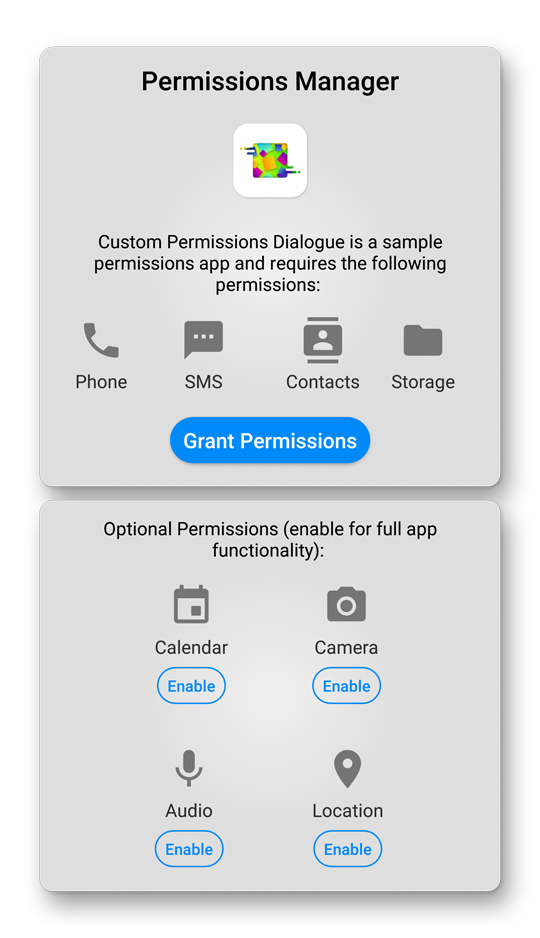
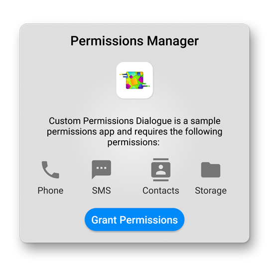
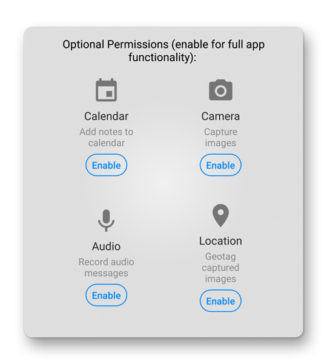
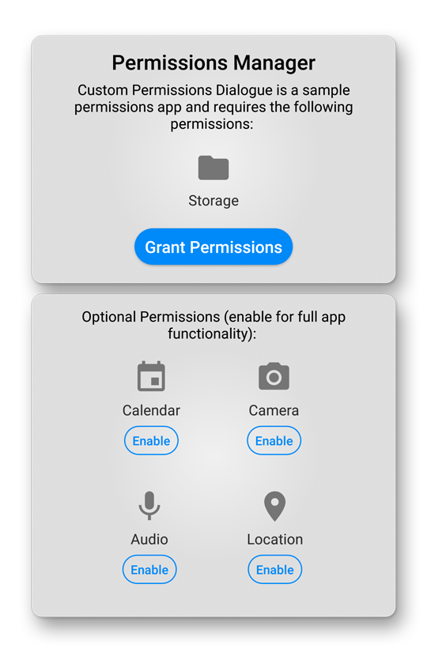

[](https://github.com/searchy2/CustomPermissionsDialogue/releases) [](https://github.com/searchy2/CustomPermissionsDialogue) [](https://github.com/searchy2/CustomPermissionsDialogue) [](https://github.com/searchy2/CustomPermissionsDialogue) [](https://github.com/searchy2/CustomPermissionsDialogue) [](https://github.com/searchy2/CustomPermissionsDialogue) [](https://github.com/searchy2/CustomPermissionsDialogue)
# Custom Permissions Dialogue


Custom Permissions Dialogue is the only permissions library that supports ALL permission request scenarios. This library handles multiple edge cases such as not enabling all permissions or permanently rejecting a permission request. 

Custom Permissions Dialogue is also the FIRST permissions library with a graphical interface. Not only does Custom Permissions Dialogue offer the most advanced functionality, it looks fantastic while doing so!


This library is part of the [Custom UI](http://rayliverified.com/index.php/code/) collection of beautiful, minimalistic, and customizable Android UI components.

# Gradle Dependency

Add this line to your `build.gradle` project. Use the latest release version for the version code. 

```java
repositories {
    maven { url 'https://jitpack.io' }
}
implementation 'com.github.searchy2:CustomPermissionsDialogue:latest-version'
```
# Usage

### Code

Custom Permissions Dialogue uses the Builder format to initialize a popup permissions dialogue programmatically. To request a single permissions, just drag and drop the following code into your project. It's that simple!


```java
PermissionsDialogue.Builder permissionsDialogue = new PermissionsDialogue.Builder(getActivity())
        .setMessage(getString(R.string.app_name) + " is a sample permissions app and requires the following permissions: ")
        .setShowIcon(false)
        .setRequireStorage(PermissionsDialogue.REQUIRED)
        .setOnContinueClicked(new PermissionsDialogue.OnContinueClicked() {
            @Override
            public void OnClick(View view, Dialog dialog) {
                dialog.dismiss();
            }
        })
        .build();
permissionsDialogue.show();
``` 
**IMPORTANT:** The Dialog Fragment is extremely picky about the `Activity` passed into the builder. If the improper Activity is passed, the dialogue will crash! Here's how to pass the proper Activity in the following cases:
* Activity - construct with `ClassName.this`
* Fragment - construct with `getActivity()`
* ViewHolder - construct with `getActivity().getApplicationContext()`

Do not attempt to construct the dialogue with `getContext()`. The Builder requires an Activity and passing a Context does not work! 

### Manifest

Remember to add the permissions your app requires to your manifest file. The following code contains a list of all regular Android permissions. 

```java
    <uses-permission android:name="android.permission.ACCESS_FINE_LOCATION"/>
    <uses-permission android:name="android.permission.ACCESS_NETWORK_STATE"/>
    <uses-permission android:name="android.permission.ACCESS_NOTIFICATION_POLICY"/>
    <uses-permission android:name="android.permission.ACCESS_WIFI_STATE"/>
    <uses-permission android:name="android.permission.CALL_PHONE"/>
    <uses-permission android:name="android.permission.CAMERA"/>
    <uses-permission android:name="android.permission.CHANGE_CONFIGURATION"/>
    <uses-permission android:name="android.permission.CHANGE_NETWORK_STATE"/>
    <uses-permission android:name="android.permission.CHANGE_WIFI_STATE"/>
    <uses-permission android:name="android.permission.GET_ACCOUNTS"/>
    <uses-permission android:name="android.permission.INTERNET"/>
    <uses-permission android:name="android.permission.MODIFY_AUDIO_SETTINGS"/>
    <uses-permission android:name="android.permission.NFC"/>
    <uses-permission android:name="android.permission.READ_CALENDAR"/>
    <uses-permission android:name="android.permission.READ_CALL_LOG"/>
    <uses-permission android:name="android.permission.READ_CONTACTS"/>
    <uses-permission android:name="android.permission.READ_EXTERNAL_STORAGE"/>
    <uses-permission android:name="android.permission.READ_PHONE_STATE"/>
    <uses-permission android:name="android.permission.READ_SMS"/>
    <uses-permission android:name="android.permission.READ_SYNC_SETTINGS"/>
    <uses-permission android:name="android.permission.READ_SYNC_STATS"/>
    <uses-permission android:name="android.permission.RECEIVE_BOOT_COMPLETED"/>
    <uses-permission android:name="android.permission.RECEIVE_MMS"/>
    <uses-permission android:name="android.permission.RECEIVE_SMS"/>
    <uses-permission android:name="android.permission.RECORD_AUDIO"/>
    <uses-permission android:name="android.permission.SEND_SMS"/>
    <uses-permission android:name="android.permission.SET_ALARM"/>
    <uses-permission android:name="android.permission.SYSTEM_ALERT_WINDOW"/>
    <uses-permission android:name="android.permission.VIBRATE"/>
    <uses-permission android:name="android.permission.WAKE_LOCK"/>
    <uses-permission android:name="android.permission.WRITE_CALENDAR"/>
    <uses-permission android:name="android.permission.WRITE_CALL_LOG"/>
    <uses-permission android:name="android.permission.WRITE_CONTACTS"/>
    <uses-permission android:name="android.permission.WRITE_EXTERNAL_STORAGE"/>
    <uses-permission android:name="android.permission.WRITE_SETTINGS"/>
    <uses-permission android:name="android.permission.WRITE_SMS"/>
    <uses-permission android:name="android.permission.WRITE_SYNC_SETTINGS"/>
```

# Customization

Custom Permissions Dialogue supports extensive customization options to fit your permission request needs. 

### Layouts

**All - Showcases all Custom Permissions Dialogue permissions.**



```java
PermissionsDialogue.Builder permissionsDialogue = new PermissionsDialogue.Builder(getActivity())
        .setMessage(getString(R.string.app_name) + " is a sample permissions app and requires the following permissions: ")
        .setIcon(R.mipmap.ic_launcher)
        .setRequirePhone(PermissionsDialogue.REQUIRED)
        .setRequireSMS(PermissionsDialogue.REQUIRED)
        .setRequireContacts(PermissionsDialogue.REQUIRED)
        .setRequireStorage(PermissionsDialogue.REQUIRED)
        .setRequireCamera(PermissionsDialogue.OPTIONAL)
        .setRequireAudio(PermissionsDialogue.OPTIONAL)
        .setRequireCalendar(PermissionsDialogue.OPTIONAL)
        .setRequireLocation(PermissionsDialogue.OPTIONAL)
        .setOnContinueClicked(new PermissionsDialogue.OnContinueClicked() {
            @Override
            public void OnClick(View view, Dialog dialog) {
                dialog.dismiss();
            }
        })
        .build();
permissionsDialogue.show();

```

**Required - Displays all required permissions for the user to grant.**



```java
PermissionsDialogue.Builder permissionsDialogue = new PermissionsDialogue.Builder(getActivity())
        .setMessage(getString(R.string.app_name) + " is a sample permissions app and requires the following permissions: ")
        .setIcon(R.mipmap.ic_launcher)
        .setRequirePhone(PermissionsDialogue.REQUIRED)
        .setRequireSMS(PermissionsDialogue.REQUIRED)
        .setRequireContacts(PermissionsDialogue.REQUIRED)
        .setRequireStorage(PermissionsDialogue.REQUIRED)
        .setOnContinueClicked(new PermissionsDialogue.OnContinueClicked() {
            @Override
            public void OnClick(View view, Dialog dialog) {
                dialog.dismiss();
            }
        })
        .build();
permissionsDialogue.show();
```

**Optional - Optional permissions allows user to selectively enable permissions.**



```java
PermissionsDialogue.Builder permissionsDialogue = new PermissionsDialogue.Builder(getActivity())
        .setRequireCamera(PermissionsDialogue.OPTIONAL)
        .setRequireAudio(PermissionsDialogue.OPTIONAL)
        .setRequireCalendar(PermissionsDialogue.OPTIONAL)
        .setRequireLocation(PermissionsDialogue.OPTIONAL)
        .setCameraDescription("Capture images")
        .setAudioDescription("Record audio messages")
        .setCalendarDescription("Add notes to calendar")
        .setLocationDescription("Geotag captured images")
        .setOnContinueClicked(new PermissionsDialogue.OnContinueClicked() {
            @Override
            public void OnClick(View view, Dialog dialog) {
                dialog.dismiss();
            }
        })
        .build();
permissionsDialogue.show();
```

**Single - Requests a single permission from the user.**


```java
PermissionsDialogue.Builder permissionsDialogue = new PermissionsDialogue.Builder(getActivity())
        .setMessage(getString(R.string.app_name) + " is a sample permissions app and requires the following permissions: ")
        .setShowIcon(false)
        .setRequireStorage(PermissionsDialogue.REQUIRED)
        .setOnContinueClicked(new PermissionsDialogue.OnContinueClicked() {
            @Override
            public void OnClick(View view, Dialog dialog) {
                dialog.dismiss();
            }
        })
        .build();
permissionsDialogue.show();
```

**Combined - A single permission request combined with other optional permissions that the user can grant.**



```java
PermissionsDialogue.Builder permissionsDialogue = new PermissionsDialogue.Builder(getActivity())
        .setMessage(getString(R.string.app_name) + " is a sample permissions app and requires the following permissions: ")
        .setShowIcon(false)
        .setRequireStorage(PermissionsDialogue.REQUIRED)
        .setRequireCamera(PermissionsDialogue.OPTIONAL)
        .setRequireAudio(PermissionsDialogue.OPTIONAL)
        .setRequireCalendar(PermissionsDialogue.OPTIONAL)
        .setRequireLocation(PermissionsDialogue.OPTIONAL)
        .setOnContinueClicked(new PermissionsDialogue.OnContinueClicked() {
            @Override
            public void OnClick(View view, Dialog dialog) {
                dialog.dismiss();
            }
        })
        .build();
permissionsDialogue.show();
```

**Uncancelable - Set Cancelable to false to force user to grant permissions before proceeding.**


```java
PermissionsDialogue.Builder permissionsDialogue = new PermissionsDialogue.Builder(getActivity())
        .setMessage(getString(R.string.app_name) + " is a sample permissions app and requires the following permissions: ")
        .setShowIcon(false)
        .setCancelable(false)
        .setRequireStorage(PermissionsDialogue.REQUIRED)
        .setOnContinueClicked(new PermissionsDialogue.OnContinueClicked() {
            @Override
            public void OnClick(View view, Dialog dialog) {
                dialog.dismiss();
            }
        })
        .build();
permissionsDialogue.show();
```

### Builder Attributes

`setTitle(String title)` - set Required Permissions title text.

`setMessage(String message)` - set Required Permissions message text.

`setMessageOptional(String messageOptional)` - set Optional Permissions message text.

`setOnContinueClicked(OnContinueClicked onContinueClicked)` - pass a listener to be called when the `Continue` button is clicked.

`setCancelable(boolean cancelable)` - set `false` to prevent dialogue dismissal without user granting required permissions.

`setShowIcon(boolean showicon)` - toggle icon visibility. Default icon shown is app icon.

`setIcon(int icon)` - pass a drawable resource Id to set as icon.

`setRequirePhone(Integer phone)` - set REQUIRED or OPTIONAL flag to display permission request.

`setRequireSMS(Integer sms)` - set REQUIRED or OPTIONAL flag to display permission request.

`setRequireContacts(Integer contacts)` - set REQUIRED or OPTIONAL flag to display permission request.

`setRequireCalendar(Integer calendar)` - set REQUIRED or OPTIONAL flag to display permission request.

`setRequireStorage(Integer storage)` - set REQUIRED or OPTIONAL flag to display permission request.

`setRequireCamera(Integer camera)` - set REQUIRED or OPTIONAL flag to display permission request.

`setRequireAudio(Integer audio)` - set REQUIRED or OPTIONAL flag to display permission request.

`setRequireLocation(Integer location)` - set REQUIRED or OPTIONAL flag to display permission request.

`setPhoneDescription(String phonedescription)` - set optional phone permission text.

`setSMSDescription(String smsdescription)` - set optional text message permission text.

`setContactDescription(String contactsdescription)` - set optional contact permission text.

`setCalendarDescription(String calendardescription)` - set optional calendar permission text.

`setStorageDescription(String storagedescription)` - set optional storage permission text.

`setCameraDescription(String cameradescription)` - set optional camera permission text.

`setAudioDescription(String audiodescription)` - set optional audio permission text.

`setLocationDescription(String locationdescription)` - set optional location permission text.

`build()` - Construct the Dialogue Builder.

`show()` - Display the Dialogue with Builder parameters.

View the Layouts section or the sample app for examples of how to use these Builder attributes. 

# Features Wishlist

These features would make this library even more awesome. You can contribute to this library by developing any of the features below. Or, if you really want to see a feature developed, you can sponsor me to develop the feature.

---

>Dynamic Blur Background

Create a dynamic blur to use as the dialogue's background. Currently, this library uses a transparent gradient as the dialogue's background. 

An attempt to create a dynamic blur was made and can be viewed in the `blur` branch. Unfortunately, the blur library used does not position the blurred background correctly. This issue is detailed at https://github.com/Dimezis/BlurView/issues/63

If you know how to work with the BlurView library, your help would be greatly appreciated! 

>Sensitive Permissions Walkthrough

Android has many powerful but sensitive permissions tucked away in Settings. Some apps require `Usage Access` or `Accessibility Services` in order to function. Unfortunately, there is no open source library to walk users through the process of enabling those permissions. The best way I've seen to walk users through this process is through a floating popup that provides step by step instructions. Many apps have implemented this feature but no one has open sourced it yet! :(

---

Pull requests are most welcome!

If you've fixed a bug or have a feature you've added, just create a pull request. If you've found a bug, file an issue. If you have any questions or would like to discuss upcoming features, please get in touch. You can get in touch with me in the Contact section below. 

# ★ Acknowledgements ★
**♥ Developer ♥**

[Ray Li](https://rayliverified.com)

**♥ Designer ♥**

[Ray Li](https://rayliverified.com)

# ★ Get in Touch ★
<a href="mailto:ray.li.verified@gmail.com">
  
</a>
<a href="https://rayliverified.com">
  
</a>
<a href="https://twitter.com/RayLiVerified">
  
</a>
<a href="https://linkedin.com/in/rayliverified/">
  
</a>
<a href="https://www.uplabs.com/ray">
  
</a>
<a href="https://github.com/searchy2">
  
</a>

# Apps Using This Library

Want to be here? You can include yourself by making a `pull request`. 

<table>
    <tr>
		<td></td>
		<td><a href="https://github.com/searchy2/Rocket-Notes">Rocket Notes</a></td>
	</tr>
	<tr>
		<td></td>
		<td><a href="https://play.google.com/store/apps/details?id=io.ideastarter">Crowdfunding Community</a></td>
	</tr>
    <tr>
		<td></td>
		<td><a href="https://play.google.com/store/apps/details?id=com.blankicon">Blank Icon</a></td>
	</tr>
</table>

#### Search Terms
android, popup, permission, permissions, dialog, dialogs, Marshmallow, grant, enable, give, manager
